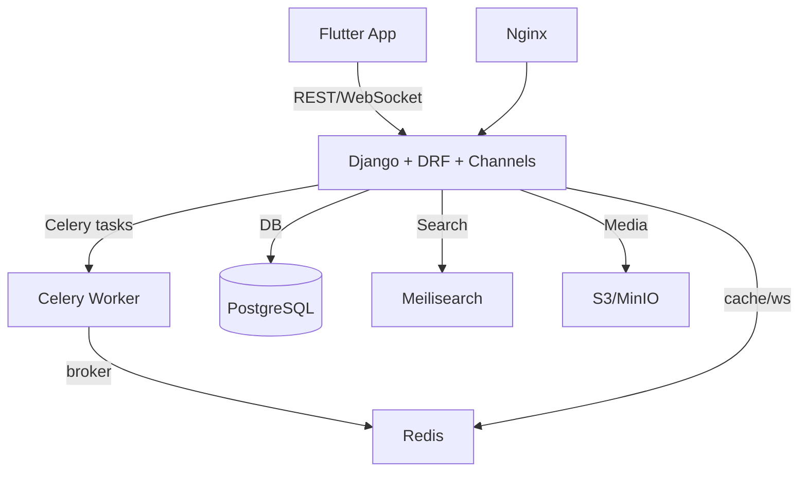

## Architektura

```mermaid
flowchart TD
  A[Flutter App] -- REST/WebSocket --> B[Django + DRF + Channels]
  B -- Celery tasks --> C[Celery Worker]
  C -->|broker| D[Redis]
  B -->|cache/ws| D
  B -->|DB| E[(PostgreSQL)]
  B -->|Search| F[Meilisearch]
  B -->|Media| G[S3/MinIO]
  H[Nginx] --> B
```

