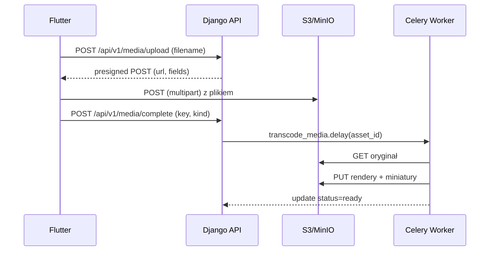

## Pipeline wideo (upload → transcode → thumbnails)

```mermaid
sequenceDiagram
    participant FE as Flutter
    participant API as Django API
    participant S3 as S3/MinIO
    participant WRK as Celery Worker

    FE->>API: POST /api/v1/media/upload (filename)
    API-->>FE: presigned POST (url, fields)
    FE->>S3: POST (multipart) z plikiem
    FE->>API: POST /api/v1/media/complete (key, kind)
    API->>WRK: transcode_media.delay(asset_id)
    WRK->>S3: GET oryginał
    WRK->>S3: PUT rendery + miniatury
    WRK-->>API: update status=ready
```

