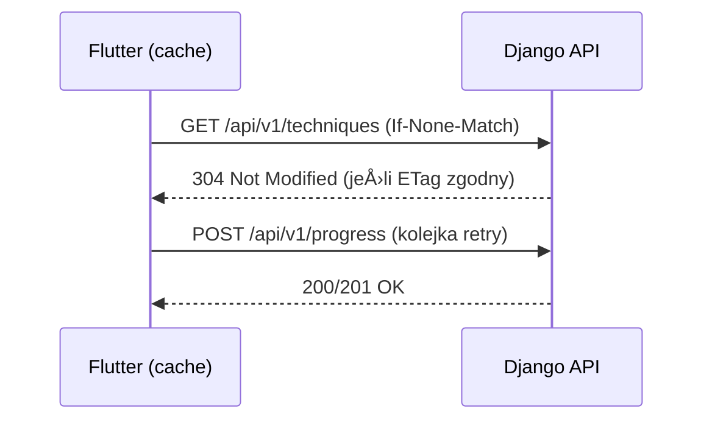

## Offline sync (delta + ETag)

```mermaid
sequenceDiagram
    participant FE as Flutter (cache)
    participant API as Django API

    FE->>API: GET /api/v1/techniques (If-None-Match)
    API-->>FE: 304 Not Modified (jeśli ETag zgodny)
    FE->>API: POST /api/v1/progress (kolejka retry)
    API-->>FE: 200/201 OK
```

