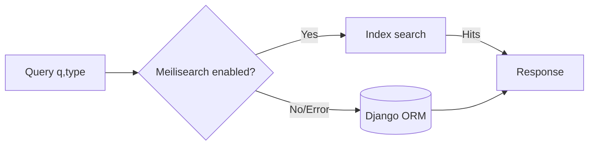

## Search with fallback

```mermaid
flowchart LR
  Q[Query q,type] --> M{Meilisearch enabled?}
  M -- Yes --> I[Index search]
  I -- Hits --> R[Response]
  M -- No/Error --> DB[(Django ORM)]
  DB --> R
```

