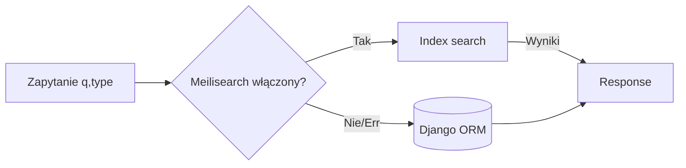

## Wyszukiwanie z fallbackiem

```mermaid
flowchart LR
  Q[Zapytanie q,type] --> M{Meilisearch włączony?}
  M -- Tak --> I[Index search]
  I -- Wyniki --> R[Response]
  M -- Nie/Err --> DB[(Django ORM)]
  DB --> R
```

